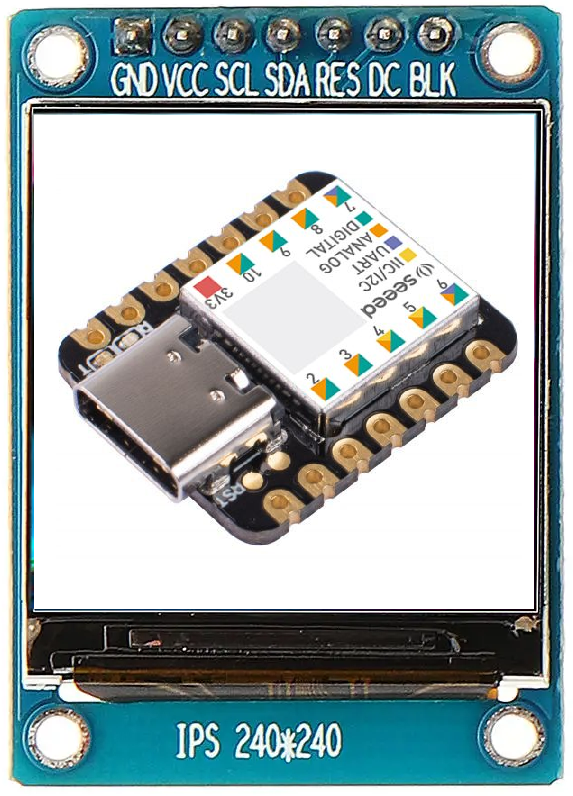

<!--
*** Thanks for checking out the Best-README-Template. If you have a suggestion
*** that would make this better, please fork the repo and create a pull request
*** or simply open an issue with the tag "enhancement".
*** Thanks again! Now go create something AMAZING! :D
***
***
***
*** To avoid retyping too much info. Do a search and replace for the following:
*** SFaull, SerialDisplay, twitter_handle, email, Serial Display, C# application and arduino firmware to allow image data from a PC to displayed on a 2.4" 240x240 ST7789 screen connected to an arduino Xiao
-->


<!-- PROJECT SHIELDS -->
<!--
*** I'm using markdown "reference style" links for readability.
*** Reference links are enclosed in brackets [ ] instead of parentheses ( ).
*** See the bottom of this document for the declaration of the reference variables
*** for contributors-url, forks-url, etc. This is an optional, concise syntax you may use.
*** https://www.markdownguide.org/basic-syntax/#reference-style-links
-->

<!--
[![Contributors][contributors-shield]][contributors-url]
[![Forks][forks-shield]][forks-url]
[![Stargazers][stars-shield]][stars-url]
[![Issues][issues-shield]][issues-url]
[![MIT License][license-shield]][license-url]
[![LinkedIn][linkedin-shield]][linkedin-url]
-->


<!-- PROJECT LOGO -->
<br />
<p align="center">
  <a href="https://github.com/SFaull/SerialDisplay">
    
  </a>

  <h3 align="center">Serial Display</h3>

  <p align="center">
    C# application and arduino firmware to allow image data from a PC to displayed on a 2.4" 240x240 ST7789 screen connected to an arduino Xiao
    <br />
    <!--
    <a href="https://github.com/SFaull/SerialDisplay"><strong>Explore the docs »</strong></a>
    <br />
    <br />
    <a href="https://github.com/SFaull/SerialDisplay">View Demo</a>
    ·
    <a href="https://github.com/SFaull/SerialDisplay/issues">Report Bug</a>
    ·
    <a href="https://github.com/SFaull/SerialDisplay/issues">Request Feature</a>
    -->
  </p>
</p>


<!-- TABLE OF CONTENTS -->
<details open="open">
  <summary><h2 style="display: inline-block">Table of Contents</h2></summary>
  <ol>
    <li>
      <a href="#about-the-project">About The Project</a>
      <ul>
        <li><a href="#built-with">Built With</a></li>
      </ul>
    </li>
    <li>
      <a href="#getting-started">Getting Started</a>
      <ul>
        <li><a href="#prerequisites">Prerequisites</a></li>
        <li><a href="#installation">Installation</a></li>
      </ul>
    </li>
    <li><a href="#usage">Usage</a></li>
    <li><a href="#roadmap">Roadmap</a></li>
    <li><a href="#contributing">Contributing</a></li>
    <li><a href="#license">License</a></li>
    <li><a href="#contact">Contact</a></li>
    <li><a href="#acknowledgements">Acknowledgements</a></li>
  </ol>
</details>


<!-- ABOUT THE PROJECT -->
## About The Project

[![Product Name Screen Shot][product-screenshot]](https://example.com)

This project aims to display content from a Windows PC onto a 240x240 pixel display connected via USB (Virtual COM port).


### Built With

* []() Visual Studio 2019
* []() Visual Studio Code with Platform IO extension


<!-- GETTING STARTED -->
## Getting Started

To get a local copy up and running follow these simple steps.

### Prerequisites

Assembled hardware

### Installation

1. Clone the repo
   ```sh
   git clone https://github.com/SFaull/SerialDisplay.git
   ```
2. Use Platform IO to build and upload the display driver code to the Seeeduino Xio
3. Open the Visual Studio solution, build and run the application


<!-- USAGE EXAMPLES -->
## Usage

Connect the Seeeduino Xiao to the PC with a USB C cable (ensure device has been assigned a COM port in the Windows Device Manager)

Within the PC application, press the connect button to establish connection to the USB display


<!-- ROADMAP -->
## Roadmap

This is a side project, there are no plan unless features are requested.


<!-- CONTRIBUTING -->
## Contributing

Contributions are what make the open source community such an amazing place to be learn, inspire, and create. Any contributions you make are **greatly appreciated**.

1. Fork the Project
2. Create your Feature Branch (`git checkout -b feature/AmazingFeature`)
3. Commit your Changes (`git commit -m 'Add some AmazingFeature'`)
4. Push to the Branch (`git push origin feature/AmazingFeature`)
5. Open a Pull Request


<!-- LICENSE -->
## License

Do what you want


<!-- CONTACT -->
## Contact

Project Link: [https://github.com/SFaull/SerialDisplay](https://github.com/SFaull/SerialDisplay)


<!-- ACKNOWLEDGEMENTS -->
## Acknowledgements

* []()
* []()
* []()


<!-- MARKDOWN LINKS & IMAGES -->
<!-- https://www.markdownguide.org/basic-syntax/#reference-style-links -->
[contributors-shield]: https://img.shields.io/github/contributors/SFaull/repo.svg?style=for-the-badge
[contributors-url]: https://github.com/SFaull/repo/graphs/contributors
[forks-shield]: https://img.shields.io/github/forks/SFaull/repo.svg?style=for-the-badge
[forks-url]: https://github.com/SFaull/repo/network/members
[stars-shield]: https://img.shields.io/github/stars/SFaull/repo.svg?style=for-the-badge
[stars-url]: https://github.com/SFaull/repo/stargazers
[issues-shield]: https://img.shields.io/github/issues/SFaull/repo.svg?style=for-the-badge
[issues-url]: https://github.com/SFaull/repo/issues
[license-shield]: https://img.shields.io/github/license/SFaull/repo.svg?style=for-the-badge
[license-url]: https://github.com/SFaull/repo/blob/master/LICENSE.txt
[linkedin-shield]: https://img.shields.io/badge/-LinkedIn-black.svg?style=for-the-badge&logo=linkedin&colorB=555
[linkedin-url]: https://linkedin.com/in/SFaull